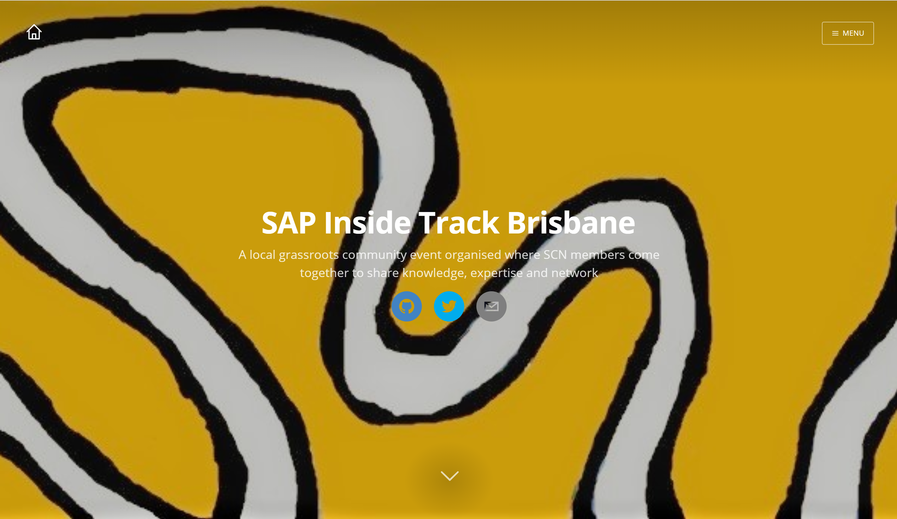

# SITBNE Site Generator
A site generator for SITBNE built using the [Gatsby](https://www.gatsbyjs.com/) v2 fork of [gatsby-starter-casper](https://github.com/haysclark/gatsby-starter-casper) by [@haysclark](https://github.com/haysclark). 



Please feel free to fork this and build out your own Inside Track Website.  Our site is hosted for free using GitHub pages and can be found at [https://sitbne.github.io/](https://sitbne.github.io/).

## Getting Started
This repo was built using Gatsby CLI version: 5.7.0 and Node version 18.14.2

Clone the repo or a fork of the repo and install it manually.

```sh
git clone https://github.com/SAPInsideTrackBrisbane/sitbne-site-generator.git <YourProjectName> # Clone the project
cd <YourProjectname>
rm -rf .git # Optional, you can leave the .git history for future rebasing
npm install # or yarn install
npm run develop # or gatsby develop
```

## Configuration

 Edit the export object in `data/SiteConfig`:

 ```js
 module.exports = {
     blogPostDir: "sample-posts", // The name of directory that contains your posts.
     blogAuthorDir: "sample-authors", // The name of directory that contains your authors.
     blogAuthorId: "casper", // The default and fallback author ID used for blog posts without a defined author.
     siteTitle: "Gatsby Casper Starter", // Site title.
     siteTitleAlt: "GatsbyJS Casper Theme Starter", // Alternative site title for SEO.
     siteLogo: "/logos/logo-1024.png", // Logo used for SEO and manifest.
     siteUrl: "https://haysclark.github.io", // Domain of your website without pathPrefix.
     pathPrefix: "/gatsby-starter-casper", // Prefixes all links. For cases when deployed to example.github.io/gatsby-starter-casper/.
     siteDescription: "A Casper themed GatsbyJS stater based on the Advanced Starter.", // Website description used for RSS feeds/meta description tag.
     siteCover: "/images/blog-cover.jpg", // Optional, the cover image used in header for home page.
     siteNavigation: true, // If navigation is enabled the Menu button will be visible
     siteBanner:"Register now for our upcoming event on February 27th", // Site Banner 
     siteBannerUrl: "/february-2019", //Path to page to navigate from Site Banner
     siteRss: "/rss.xml", // Path to the RSS file.
     siteRssAuthor: "Casper User", // The author name used in the RSS file
     // siteFBAppID: "1825356251115265", // optional, sets the FB Application ID for using app insights
     sitePaginationLimit: 10, // The max number of posts per page.
     googleAnalyticsID: "UA-111982167-1", // GA tracking ID.
     siteSocialUrls: [
       "https://github.com/haysclark/gatsby-starter-casper",
       "https://twitter.com/gatsbyjs",
       "mailto:gatsbyjs@example.com"
     ],
     postDefaultCategoryID: "Tech", // Default category for posts.
     // Links to social profiles/projects you want to display in the navigation bar.
     userLinks: [
       {
         label: "GitHub",
         url: "https://github.com/haysclark/gatsby-starter-casper",
         iconClassName: "fa fa-github" // Disabled, see Navigation.jsx
       },
       {
         label: "Twitter",
         url: "https://twitter.com/gatsbyjs",
         iconClassName: "fa fa-twitter" // Disabled, see Navigation.jsx
       },
       {
         label: "Email",
         url: "mailto:gatsbyjs@example.com",
         iconClassName: "fa fa-envelope" // Disabled, see Navigation.jsx
       }
     ],
     // Copyright string for the footer of the website and RSS feed.
     copyright: {
       label: "Gatsby Casper Starter" // Label used before the year
       year: "2018" // optional, set specific copyright year or range of years, defaults to current year
       url: "https://www.gatsbyjs.org/" // optional, set link address of copyright, defaults to site root
     },
     themeColor: "#c62828", // Used for setting manifest and progress theme colors.
     backgroundColor: "#e0e0e0", // Used for setting manifest background color.
     promoteGatsby: true // Enables the GatsbyJS promotion information in footer.
   };
 ```

 You can also optionally set `pathPrefix`:
 ```js
 module.exports = {
  // Note: it must *not* have a trailing slash.
       pathPrefix: '/gatsby-starter-casper', // Prefixes all links. For cases when deployed to example.github.io/gatsby-starter-casper/.
}

 ```

 WARNING: Make sure to edit `static/robots.txt` to include your domain for the sitemap!

## Deployment
The latest version of the app is now deployable via github actions.  The yml config file can be found in the ".github" directory.  The action is triggered by merging the pull request to the "main" branch, which at this stage is limited to a small group.

## Content

### Posts

Posts are authored using Markdown and include some optional YAML frontmatter data properties.  Each post should have a separate folder for the .md file in addition to any images or other media related to that post.  Posts are stored in a subfolder in the ```/content/``` directory; the target subfolder is set by the _blogPostDir_ property in _SiteConfig.js_.

### Authors

Each post can reference the author of the post, if the author is not set the default author will be used; which is controlled by the _blogAuthorId_ property in _SiteConfig.js_.  All authors, including the default author (aka _blodAuthorId_) must have an author JSON file.  These JSON files MUST be stored in a folder names ```authors```, for Gatsby to parse them correctly.  The location of this ```authors``` folder can be controlled by the _blogAuthorDir_ property in _SiteConfig.js_. It is possible to have the ```authors``` folder inside the  _blogPostDir_ folder.

### SITBNE Content

If you're speaking at SITBNE and want to update your own content. Please feel free to modify your own author file in the "content/authors" directory and/or the associated markdown file in the "content/posts" directory.  Blog posts are stored in dated subdirectories based on the proposed event date.  If you need to store supporting documents for your content, please keep them in the subdirectory of the related blog post.  Ideally if these could be hosted elsewhere, it will help keep our web app bundle size down.  

You'll need to create a draft pull request from a fork prior to making any changes.  See [here](https://docs.github.com/en/pull-requests/collaborating-with-pull-requests/proposing-changes-to-your-work-with-pull-requests/creating-a-pull-request-from-a-fork) for more deteils on how to do that.  Once you're all set, mark the pull request as "ready" and one of our team will review it.  


## License

MIT
